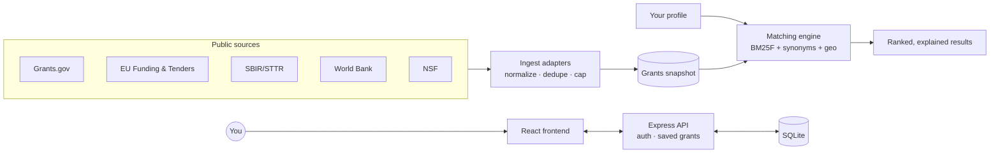

<p align="center">
  
</p>

<h1 align="center">Grants.DivAmok</h1>

<p align="center">
  A free, global grant finder that matches you to <b>live funding you're actually eligible for</b> — and explains <i>why</i>.
</p>

Grants.DivAmok aggregates open funding opportunities from public sources (Grants.gov, the EU,
NSF, the World Bank, SBIR), normalizes them, and ranks them against your profile with a
transparent, explainable matching engine. No paywall, no API keys required to run it.


---

## ✨ Features

- **Live, free data** — pulled from Grants.gov, EU Funding & Tenders, NSF, the World Bank & SBIR; refreshed when you sign in.
- **Explainable matching** — every result shows a fit score, the words that matched, a plain-language reason, and *what to verify* before applying.
- **Eligibility-aware ranking** — geography / recipient-type are honored, then **BM25F** relevance over titles + descriptions with synonym expansion.
- **Accounts & saved grants** — JWT auth; save grants to your account, synced wherever you sign in.
- **Adaptive intake** — searchable country picker (with flags), 120+ sector multi-select, audience selector.
- **Responsive** — works on desktop and mobile.

## 🏗️ Architecture



Three parts:

1. **Frontend** (`divamok-grant-finder-app-frontend/`) — React + Vite + TypeScript + Tailwind. Hosts the UI and the **client-side matching engine** (`src/lib/match.ts`), and talks to the API.
2. **API** (`divamok-grant-finder-app-api/`) — Express + SQLite + JWT. Handles register/login and per-user saved grants.
3. **Ingestion** (`divamok-grant-finder-app-frontend/ingest/`) — Node ESM adapters that pull each source, normalize to a common `Grant` shape, dedupe, and produce the dataset the matcher ranks. Served live in dev via a Vite middleware at `/api/grants`, with a bundled snapshot fallback so the app works offline.

## 🧱 Tech stack

- **Frontend:** React 18, Vite, TypeScript, Tailwind CSS v4, React Router
- **API:** Express, SQLite (`sqlite`/`sqlite3`), `jsonwebtoken`, `bcrypt`
- **Ingestion:** Node ESM, native `fetch`

## 📁 Project structure

```
divamok-grant-finder-app/
├── divamok-grant-finder-app-frontend/    # React + Vite app
│   ├── src/
│   │   ├── pages/        # Home, Intake (/find), Matches, Saved, Login, Settings
│   │   ├── components/   # match cards, modal, layout, home sections
│   │   ├── lib/          # match.ts (engine), concepts, auth, saved, store, deadline
│   │   └── data/         # grants.generated.json (snapshot)
│   ├── ingest/           # source adapters + collector (npm run ingest)
│   └── vite.config.ts    # API proxy + dev /api/grants endpoint
├── divamok-grant-finder-app-api/         # Express + SQLite API
│   ├── routes/           # auth.js, saved.js
│   ├── middleware/       # auth.js (JWT verify)
│   └── database.js       # schema: users, saved_grants
├── start.sh / stop.sh    # run / stop both services
└── push-to-github.sh     # commit + push helper (prompts for a message)
```

## 🚀 Getting started

**Prerequisites:** Node 18+.

```bash
# 1. install deps
cd divamok-grant-finder-app-frontend && npm install
cd ../divamok-grant-finder-app-api   && npm install

# 2. configure the API
cd ../divamok-grant-finder-app-api
cp .env.example .env          # then set a strong JWT_SECRET

# 3. run both (interactive menu — choose 1 for All)
cd ..
./start.sh                    # press Ctrl+C to stop everything
```

- **Frontend:** http://localhost:5173 (or :5174)  ·  **API:** http://localhost:3000
- On the same Wi-Fi, open the printed **Network** URL on your phone.
- Refresh the live dataset any time: `cd divamok-grant-finder-app-frontend && npm run ingest`.

## 🔎 Data sources

| Source | What | Auth |
| --- | --- | --- |
| **Grants.gov** (Search2 + fetchOpportunity) | US open grant calls + descriptions/eligibility | none |
| **EU Funding & Tenders** (`grantsTenders.json`) | EU open calls | none |
| **SBIR / STTR** | US R&D solicitations | none (WAF-flaky) |
| **World Bank Projects** | Global development funding (funder intel) | none |
| **NSF Awards** | US research awards (funder intel) | none |

Open *calls* are ranked to apply to; *awards* are kept as funder intelligence and clearly flagged.

## 🧠 How matching works

1. Your **sectors + pitch** expand via a synonym/concept map (so "pharmacy" finds "clinical / medication").
2. Each grant is scored with **BM25F** over title (×3), funder (×1.5) and description — rare/distinctive words weigh more, term frequency saturates, length is normalized.
3. A **relevance threshold** drops zero-overlap grants once you express intent (no more padding to a fixed count).
4. **Geo** eligibility boosts; ineligible regions are flagged ("geo blocker"), not hidden.
5. The engine is **pure & deterministic** — same profile + data → same ranking, every time.

## 📜 Scripts

- `./start.sh` — start frontend + API (Ctrl+C stops both).
- `./stop.sh` — stop services.
- `./push-to-github.sh` — stage everything, prompt for a description, commit & push.
- `npm run ingest` (in the frontend) — refresh the grants snapshot from live sources.

## 🗺️ Roadmap

- Semantic (embeddings) + LLM intent understanding & re-ranking
- Daily auto-ingest (cron) + hosted deployment
- Funder prospecting from IRS 990s / historical awards

## 📝 License

[MIT](LICENSE) © 2026 DivAmok
